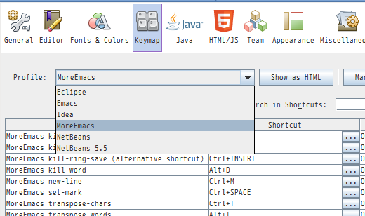

# More Emacs for NetBeans

* More Emacs is a NetBeans module for emacs users.
* NetBeans provides the emacs like key bindings.
 But emacs users require more emacs like key bindings.
 More emacs plugin provides more emacs like key bindings.
 The key bind scheme of more emacs is a child schema of Eclispe's emacs scheme.
 It adds some key bindings or overrides some bindings to emacs scheme.

## Install

* JDK 1.8 or higher required.
* Not ready yet. It will be found at NetBeans portal in a few days
* open Tools/Options dialog, and open Keymap tab.
* select "MoreEmacs".

## Key Bindings

* The following list is key bindings of more emacs.
  * It is the difference from emacs bindings of NetBeans.
* 'rebind' means the rebind of NetBeans implementation.
* 'nb emacs' means the binding of NetBeans Emacs bidings.

### Editor Bindings

* [The complete editor bindings definition of MoreEmacs.](https://github.com/yas99en/moreemacsnb/blob/master/core/src/io/github/yas99en/moreemacsnb/core/actions/MoreEmacs-keybindings.xml)
    * [modifier symbols](http://bits.netbeans.org/8.0/javadoc/org-openide-util/org/openide/util/Utilities.html#stringToKey(java.lang.String))

|function|	binding|	description|
|:-----------|:------------|:------------|
|C-space|MoreEmacs set-mark|mark current posision|
|C-x C-x|MoreEmacs exchange-point-and-mark||
|C-w|MoreEmacs kill-region|cut region to clipboard|
|M-w|MoreEmacs kill-ring-save|copy region to clipboard|
|C-y|paste-from-clipboard|nb emacs|
|C-x u|undo|nb emacs|
|C-/|undo|nb emacs|
|M-/|completion-show|rebind|
|C-M-/|all-completion-show|rebind|
|C-f|caret-forward|nb emacs|
|C-b|caret-backwar|nb emacs|
|MS-,|caret-begin|nb emacs|
|MS-.|caret-begin|nb emacs|
|C-a|caret-line-first-column|nb emacs|
|C-e|caret-begin|nb emacs|
|C-p|caret-up|nb emacs|
|C-n|caret-down|nb emacs|
|C-v|page-down|nb emacs|
|M-v|page-up|nb emacs|
|C-l|adjust-window-center|rebind|
|C-k|cut-to-line-end|nb emacs|
|C-d|delete-next|nb emacs|
|C-h|delete-previous|rebind|
|BS|delete-previous|rebind|
|M-\\|MoreEmacs delete-horizontal-space||
|M-f|MoreEmacs forward-word||
|M-b|MoreEmacs backward-word||
|M-d|MoreEmacs kill-word||
|M-BS|MoreEmacs backward-kill-word||
|M-c|MoreEmacs capitalize-word||
|M-u|MoreEmacs upcase-word||
|M-l|MoreEmacs downcase-word||
|C-c C-c|MoreEmacs toggle-comment-region|toggles comment|
|C-i|MoreEmacs indent-line||
|TAB|MoreEmacs indent-line||
|C-q TAB|insert-tab|nb emacs|
|C-j|insert-break|rebind|
|C-m|MoreEmacs new-line||
|C-o|split-line|rebind|
|C-x r k|MoreEmacs kill-rectangle||
|C-x r y|MoreEmacs yank-rectangle||
|C-s|find|nb emacs|
|C-r|find|rebind|
|M-s|find-next|nb emacs|
|M-r|find-previous|nb emacs|
|MS-5|replace|nb emacs|
|C-g|MoreEmacs keyboard-quit|dispatch escape key down/up events.|
|C-t|MoreEmacs transpose-chars|Sorry, the display may get corrupted.|
|M-t|MoreEmacs transpose-words||
|MS-f|fix-imports|nb emacs|
|M-S-r|in-place-refactoring|rebind|

### Menu Bindings

* [The complete menu bindings definition of MoreEmacs.](https://github.com/yas99en/moreemacsnb/blob/master/core/src/io/github/yas99en/moreemacsnb/core/layer.xml)
    * [modifier symbols](http://bits.netbeans.org/8.0/javadoc/org-openide-util/org/openide/util/Utilities.html#stringToKey(java.lang.String))

|function|	binding|	description|
|:-----------|:------------|:------------|
|C-x 0|CloseWindowAction|rebind|
|C-x C-c|CloseAllDocumentsAction|rebind. Sorry this is my preference.|

## Unicode

* The supplementary characters are supported. All characters are treated as code point.
* East Asian Width is supported. In the column calculation of rectangle operation, the width of ambiguous characters are 2 for CJK languages and 1 for other languages.

## Change Log

* 2015/12/15
  * changed C-r to find
  * added M-S-r as in-place-refactoring
* 2015/12/12
  * Prepareing the first release.

## Links

* [NetBeans Plugin Portal](http://plugins.netbeans.org/)

